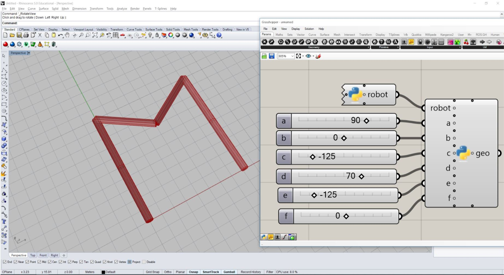

# Assignment 02

Build your own robot model.

* Build your own robot with a certain number n of links and n - 1 configurable joints.
* Create a `Configuration` with certain values and the correct joint types.
* Create a `Artist`.
* Use the artist to update the robot with the created configuration, such that it configures into the letter of your choice (or any other identifiable figure).

## How to start

Use the following code as a starting point for your assignment:

```python
"""Assignment 02: Build your own robot model
"""
from compas.artists import Artist
from compas.datastructures import Mesh
from compas.geometry import Circle
from compas.geometry import Cylinder
from compas.geometry import Frame
from compas.geometry import Plane
from compas.geometry import Translation
from compas.robots import Configuration
from compas.robots import Joint
from compas.robots import RobotModel

# create cylinder in yz plane
radius, length = 0.3, 5
cylinder = Cylinder(Circle(Plane([0, 0, 0], [1, 0, 0]), radius), length)
cylinder.transform(Translation.from_vector([length / 2.0, 0, 0]))

# create robot model
model = RobotModel("robot", links=[], joints=[])

# link meshes (calling Mesh.from_shape effectively creates a copy of the shape)
mesh1 = Mesh.from_shape(cylinder)
mesh2 = Mesh.from_shape(cylinder)

# add links
link0 = model.add_link("world")
link1 = model.add_link("link1", visual_mesh=mesh1, visual_color=(0.2, 0.5, 0.6))
link2 = model.add_link("link2", visual_mesh=mesh2, visual_color=(0.5, 0.6, 0.2))

# add joints between the links
axis = (0, 0, 1)

origin = Frame.worldXY()
model.add_joint("joint1", Joint.CONTINUOUS, link0, link1, origin, axis)

origin = Frame((length, 0, 0), (1, 0, 0), (0, 1, 0))
model.add_joint("joint2", Joint.CONTINUOUS, link1, link2, origin, axis)

# Create a configuration object matching the number of joints in your model
# configuration = ....

# Update the model using the artist
artist = Artist(model)
# artist.update ...

# Render everything
artist.draw_visual()
artist.redraw()
```

## Helpful links

* [Robot model tutorial](https://compas.dev/compas/latest/tutorial/robots.html#)

## Expected result

> NOTE: It should be some recognizable shape, but not necessarily a letter M as in this image!



## How to submit your assignment

1. You should have forked this repository last week, if not, check assignment submission of last week's lecture.
2. Make sure your local clone is up to date

       (fs2022) git checkout main
       (fs2022) git pull origin

3. Use a branch called `assignment-02` for this week's assignment

       (fs2022) git checkout -b assignment-02
       (fs2022) git push -u assignments assignment-02

4. Create a folder with your name and last name, eg. `david_bowie` (make sure it is inside the current assignment folder)
5. Create a Python file (eg. `assignment_02.py`) and paste the starting point code.
6. Solve the coding assignment and commit
    <details><summary><small>(How do I commit?)</small></summary>
    <p>

    Usually, commits are done from a visual client or VS code,
    but you can also commit your changes from the command line:

       (fs2022) git add lecture_02/assignment_02/david_bowie/\* && git commit -m "hello world"

    
    </p>
    </details>

8. Once you're ready to submit, push the changes:

       (fs2022) git push assignments

9. And create a pull request (<small>[What's a pull request?](https://docs.github.com/en/pull-requests/collaborating-with-pull-requests/proposing-changes-to-your-work-with-pull-requests/about-pull-requests)</small>)

    1. Open your browser and go to your fork
    2. Create the pull request clicking `Compare & pull request` and follow the instructions

    
