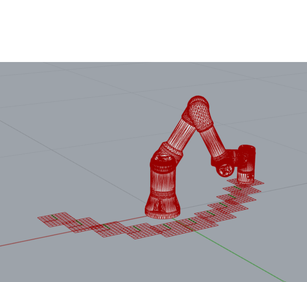

# Assignment 03

Using inverse kinematics

* Start the MoveIt Noetic container for a UR3e on your laptop
* Use the `RosClient` to load the robot
* Taking a robot and a list of frames as parameter, calculate a feasible configuration for each of the frames
* Try to find an optimal start_configuration for each so that the motion from one config to the next is minimized
* Store all found configurations in a JSON file using `compas.json_dump` or `compas.json_dumps`
* Commit the `assignment_03.py` AND the `assignment_03.json` file in your submission

## How to start

Use the following code as a starting point for your assignment:

```python
"""Assignment 03: Using inverse kinematics
"""
import os
import compas
from compas_fab.backends import RosClient
from compas_fab.robots import Configuration

from compas.geometry import Frame
from compas.geometry import Point
from compas.geometry import Vector


# Step 1: Inside this function, complete the main part of the solution for the assignment:
#  - Taking a robot and a list of frames as parameter, calculate a feasible configuration for each of the frames
#  - Try to find an optimal start_configuration for each so that the motion from one config to the next is minimized
def calculate_ik_for_frames(robot, frames):
    configs = []
    # ...
    return configs


# Step 2: store all found configurations in a JSON file using compas.json_dump or compas.json_dumps
def store_configurations(configurations, filename):
    # ...
    pass

# Use the following to test from the command line
# Or copy solution_viewer.ghx next to the folder where you created assignment_03.py to visualize the same in Grasshopper
if __name__ == '__main__':

    frames = [
        Frame(Point(-0.329, 0.059, 0.082), Vector(1.000, 0.000, 0.000), Vector(0.000, -1.000, 0.000)),
        Frame(Point(-0.260, 0.129, 0.082), Vector(1.000, 0.000, 0.000), Vector(0.000, -1.000, 0.000)),
        Frame(Point(-0.186, 0.194, 0.082), Vector(1.000, 0.000, 0.000), Vector(0.000, -1.000, 0.000)),
        Frame(Point(-0.106, 0.252, 0.082), Vector(1.000, 0.000, 0.000), Vector(0.000, -1.000, 0.000)),
        Frame(Point(-0.020, 0.299, 0.082), Vector(1.000, 0.000, 0.000), Vector(0.000, -1.000, 0.000)),
        Frame(Point(0.074, 0.329, 0.082), Vector(1.000, 0.000, 0.000), Vector(0.000, -1.000, 0.000)),
        Frame(Point(0.172, 0.330, 0.082), Vector(1.000, 0.000, 0.000), Vector(0.000, -1.000, 0.000)),
        Frame(Point(0.263, 0.295, 0.082), Vector(1.000, 0.000, 0.000), Vector(0.000, -1.000, 0.000)),
        Frame(Point(0.339, 0.233, 0.082), Vector(1.000, 0.000, 0.000), Vector(0.000, -1.000, 0.000)),
        Frame(Point(0.400, 0.155, 0.082), Vector(1.000, 0.000, 0.000), Vector(0.000, -1.000, 0.000)),
        Frame(Point(0.448, 0.070, 0.082), Vector(1.000, 0.000, 0.000), Vector(0.000, -1.000, 0.000))]

    # Loads the robot from ROS
    with RosClient('localhost') as client:
        robot = client.load_robot()

        # Step 1: calculate IK solutions for each frame
        configurations = calculate_ik_for_frames(robot, frames)
        print("Found {} configurations".format(len(configurations)))

        # Step 2: store all configurations in a JSON file
        filename = os.path.join(os.path.abspath(os.path.dirname(__file__)), 'assignment_03.json')
        store_configurations(configurations, filename)
        print("Stored results in {}".format(filename))
```

## Expected result



## How to submit your assignment

1. You should have forked this repository last week, if not, check [assignment submission instructions in lecture 02](../../lecture_02/assignment_01#how-to-submit-your-assignment).
2. Make sure your local clone is up to date

       (fs2022) git checkout main
       (fs2022) git pull origin

3. Use a branch called `assignment-03` for this week's assignment

       (fs2022) git checkout -b assignment-03
       (fs2022) git push -u assignments assignment-03

4. Create a folder with your name and last name, eg. `david_bowie` (make sure it is inside the current assignment folder)
5. Create a Python file named `assignment_03.py` and paste the starting point code.
6. For visual inspection, copy the file `solution_viewer.ghx` in the same folder of your `assignment_03.py`.
6. Solve the coding assignment and commit both the Python file and the JSON file
    <details><summary><small>(How do I commit?)</small></summary>
    <p>

    Usually, commits are done from a visual client or VS code,
    but you can also commit your changes from the command line:

       (fs2022) git add lecture_04/assignment_03/david_bowie/\* && git commit -m "hello world"

    
    </p>
    </details>

8. Once you're ready to submit, push the changes:

       (fs2022) git push assignments

9. And create a pull request (<small>[What's a pull request?](https://docs.github.com/en/pull-requests/collaborating-with-pull-requests/proposing-changes-to-your-work-with-pull-requests/about-pull-requests)</small>)

    1. Open your browser and go to your fork
    2. Create the pull request clicking `Compare & pull request` and follow the instructions

    
