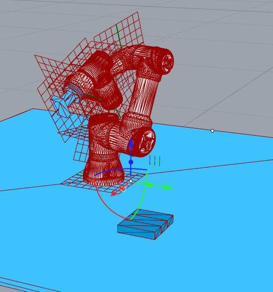

# Assignment 04

* Define a parametric assembly based on examples `601-612`.
* Goal 1: Ensure at least 20 parts are independently buildable (ie. there are trajectories for all).
* Goal 2: Ensure at least 20 parts are buildable taking into account previously built parts.

## How to start

* Copy examples `601-612` into your assignment folder.
* Use example `601_assembly_design.ghx` to design a new parametric assembly.
* Use examples `61x` to assign a sequence to the assembly.
* Use example `603_assembly_planning.py` to plan all parts.
* Use example `605_viewer.ghx` for visual inspection of the solutions.
* Your will end up with 3 JSON files: `601_assembly_design.json`, `602_assembly_sequenced.json` and `603_assembly_planning.json`.
* Commit all the files in your assignment folder (Python, GH and JSON).

## Expected result

## How to submit your assignment

> NOTE: The command line instructions for git can be replaced by visual clients such as Github Desktop or VS Code git integration, there are here only as guidance.

1. You should have forked this repository last week, if not, check [assignment submission instructions in lecture 02](../../lecture_02/assignment_01#how-to-submit-your-assignment).
2. Make sure your local clone is up to date

       (fs2022) git checkout main
       (fs2022) git pull origin

3. Use a branch called `assignment-04` for this week's assignment

       (fs2022) git checkout -b assignment-04
       (fs2022) git push -u assignments assignment-04

4. Create a folder with your name and last name, eg. `david_bowie` (make sure it is inside the current assignment folder)
5. Copy examples `601-612` into the folder created above and use it as starting point code.
6. Solve the assignment and commit all the files in your assignment folder (Python, GH and JSON).
    

<small>(How do I commit?)</small>

    

    Usually, commits are done from a visual client or VS code,
    but you can also commit your changes from the command line:

       (fs2022) git add lecture_07/assignment_04/david_bowie/\* && git commit -m "hello world"

    
    

    

8. Once you're ready to submit, push the changes:

       (fs2022) git push assignments

9. And create a pull request (<small>[What's a pull request?](https://docs.github.com/en/pull-requests/collaborating-with-pull-requests/proposing-changes-to-your-work-with-pull-requests/about-pull-requests)</small>)

    1. Open your browser and go to your fork
    2. Create the pull request clicking `Compare & pull request` and follow the instructions

    
